# EvoERP Module Interdependency Map

Status: derived (synthesized from CHM cross-reference sections across all 40+ module help-content.md files).

*Source: Cross-references sections from all [docs/03-modules/](../03-modules/) help-content.md files.*

---

## Module Tiers

Each module is assigned to one of four functional tiers:

- **Tier 1 — Core Data Entry**: modules where master records and transactions originate. These are the data sources — nothing can post without them.
- **Tier 2 — Processing/Posting**: modules that consume Tier 1 data and transform it — posting to GL, generating vouchers, updating on-hand quantities, closing work orders.
- **Tier 3 — Reporting/Analysis**: read-only reporting and analysis modules. They read but do not write transactional data.
- **Tier 4 — Administration**: system configuration, defaults, security, maintenance, and archive/purge routines.

---

## Module Summary Table

| Code | Full Name | Tier | Primary Function | Key Inputs From | Key Outputs To |
|------|-----------|------|-----------------|-----------------|----------------|
| AD | Accounting Defaults | 4 | GL/AP/checking account defaults | (system config) | AR, AP, SO, PO, IN, WO, GL, AM, CS, PR |
| AM | Accounting Maintenance | 4 | GL chart of accounts, fiscal periods, year-end close | GL transactions | GL (YE batch), AP (purge), AR (purge) |
| AP | Accounts Payable | 2 | Vendor invoices, check runs, 1099s | PO (receipts), SM-D (terms), AD-B (banks) | GL (disbursements journal), IN (cost update) |
| AR | Accounts Receivable | 2 | Customer invoices, payments, statements | SO-G (invoices), SM-D/E/F (terms/tax) | GL (cash receipts), CS (commission trigger) |
| BM | Bill of Materials | 1 | Component lists for assemblies | IN (item master), RO (sequences) | WO (pick lists/backflush), MR (explosion), ES (quoting) |
| CM | Contact Manager | 1 | CRM accounts, contacts, opportunities | AR-A (customers), SM-I-* (code tables) | AR-P (dun letters), SO (quotes/orders view) |
| CR | Contract Review | 2 | SO departmental approvals / sign-off | SO (sales orders), PS-J (signers) | SO (approval status gates shipment) |
| CS | Commission System | 2 | Salesperson commission calculation and transfer | SO-G (invoices), AR (payments), SM-G (employees) | PR (payroll commission), AP (agent vouchers) |
| DC | Data Collection | 1 | Shop-floor labor and production entry (real-time) | WO (work orders), SM-G (employees), SD-F (defaults) | WO (WOLABOR), JC (actuals), PR (shift data), SH (real-time load) |
| DE | Data Exchange | 4 | Import/export utilities for all master and transaction data | External files / SQL | IN, BM, RO, AR, AP, GL, WO, SO, PI |
| ES | Estimating | 1 | Customer quotes / cost estimates | IN (shadow DB), BM (BOMs), RO (routings), PO (RFQs) | SO (convert to order), WO (convert to work order), CM (prospect promotion) |
| FA | Fixed Assets | 2 | Asset register and depreciation posting | AM (fiscal context) | GL (depreciation journal entries) |
| FO | Features and Options | 1 | Configurable item option selection | IN (O-type items), BM (BOM structure) | SO (option pricing), WO (configured BOM), ES (configured quotes) |
| GL | General Ledger | 2 | Final financial ledger; all posting converges here | AR, AP, SO, PO, WO, IN, PR (all journals) | AM (trial balance, statements), FA (period context) |
| HH | Handheld / Scanner | 1 | Mobile data entry (labor, materials, receiving, shipping) | WO, IN, PO, PI, SO (mirrors desktop programs) | Same targets as WO-F, WO-G, WO-I, PO-C, PI-C, SO-E |
| IM | International | 4 | Multi-currency, landed costs, excise tax configuration | SM-E/F (tax codes), AD (GL accounts) | AP, AR, GL, PO, IN (currency-aware processing) |
| IN | Inventory | 1 | Item master, on-hand quantities, costs | SM-C (item classes), BM (BOM), PO (receipts), WO (issues/receipts) | SO (availability/price), MR (reorder data), GL (asset accounts), PI (physical count base) |
| JC | Job Costing | 3 | WO cost analysis — labor, material, overhead, variance | WO (all labor/material/receipt files), DC, PO (outside purchases) | GL (WIP reconciliation via JC-M) |
| LC | Lot Control | 2 | Lot number assignment and traceability | PO-C (receipts), WO-I (completions), WO-G (issues), SO-E (shipments), IN-C (adjustments) | LC-C (availability), LC-D (history) |
| MM | File/Support | 4 | Database maintenance and report template editing | TA-D, TA-M (tools), PS-A (access control) | All modules (DB integrity, RTM templates) |
| MR | MRP | 2 | Material Requirements Planning — explodes demand, generates planned orders | SO (demand), WO (supply), PO (supply), IN (on-hand/parameters), BM (structure) | WO (planned WOs via MR-I), PO (planned POs via MR-J), SH (lead times) |
| PI | Physical Inventory | 2 | Physical count capture and on-hand adjustment | IN (frozen inventory, cycle codes), WO (WIP outside scope) | IN (updated on-hand/avg cost), GL (adjusting entries) |
| PO | Purchase Orders | 1 | Vendor purchase orders, receiving, RFQs, inspection | AP-A (vendor master), IN (item master), SM-D/H (terms/calendar) | AP-C (RNI invoicing), IN (cost/qty update), JC-F (outside purchases), MR (supply data) |
| PR | Payroll | 2 | Employee payroll processing, checks, tax liabilities | SM-G (employees), WO-L-E (labor hours), DC (shift data), CS-D (commissions), AD-B (banks) | GL (payroll journal), AP (liability transfers via PR-H) |
| PS | Password Security | 4 | User access control, digital signatures, menu permissions | SM-G (employees) | All modules (access gating), PO (digital sigs), CR (approval signers) |
| QC | Quality Control | 3 | Receiving inspection, scrap/rework reporting, NCR/CAR | PO-J-C (buyoffs), WO-F/G/I/M (scrap data), DC (labor scrap) | PO-C (inspection gate), QC-G (corrective action) |
| QU | Queries | 3 | Master inquiry, calendar drill-down, SQL query execution | IN, SO, PO, WO, GL-R (Business Status), DE-A (SQL queries) | (read-only; no writes) |
| RO | Routings | 1 | Work center operations, time standards, outside processing sequences | IN (item master), SD-I (defaults) | WO (routing copy on firm), SH (scheduling data), BM-G (cost rollup step 1), JC (standards) |
| SA | Sales Analysis | 3 | Invoiced sales reporting by customer, item, salesperson | AR (invoice history), SO (open bookings), IN (costs) | (read-only; no writes) |
| SC | Serial Control | 2 | Serial number assignment and traceability | PO-C (receiving), WO-I (production), SO (shipment), IN-C (adjustments) | SC-D (history), SC-H (traceability report) |
| SD | System Defaults | 4 | Per-module configuration switches and next-number sequences | (system config) | All modules (behavior flags) |
| SH | Scheduling | 2 | WO scheduling (finite/infinite/lead time), work center load | WO (work orders), RO (work centers/times), DC (real-time load), MR (planned demand) | WO (start/finish dates), MR (lead time feedback) |
| SM | System Manager | 4 | Master table entry (customers, vendors, employees, item classes, terms, tax, calendar), archive/purge, code tables | (initial setup) | AR, AP, SO, PO, WO, IN, DC, GL, MR, QC, SA (all master records) |
| SO | Sales Orders | 1 | Customer sales orders, quotes, invoicing, shipment | AR-A (customer master), IN (item/price), CS-A (salesperson) | AR (invoices via SO-G), GL (SO-G), WO (SO-N convert), MR (demand dates) |
| SR | Service/Repair | 1 | Service and repair order entry, invoicing | IN (S/R items), AR-A (customers), SD-T (defaults) | WO (SR-C convert), AR (SR-G post invoice), GL (WIP-to-COGS) |
| SU | Setup (Grid/Drill) | 4 | Grid lookup configuration, drill-down menu setup | PS-A (security levels) | QU, IN-A, IN-B (lookup grid behavior) |
| TA | Table Admin | 4 | Database maintenance, menu admin, backup, SQL editor, program scheduler | PS-A (access control) | All modules (DB integrity, menu structure) |
| US | User Settings | 4 | Per-user preferences, triggers, electronic signature, menu customization | PS (passwords), SM (language), TA-H (menu) | CR (CR APPROVE trigger), PO (DIGSIG APP trigger) |
| UT | Utilities | 4 | Low-level data manipulation — clear data, field replace, recalc GL/inventory, fix binary zeroes | (admin use only) | GL, IN, AR, AP, PR, SO, PO (bulk corrections) |
| WC | Warehouse Control | 2 | Bin location management and assignment | IN (item master), SD-S (defaults) | HH (bin prompts), PI (bin-level counts), SO (pick guidance), WO (bin-level issues) |
| WO | Work Orders | 1 | Manufacturing work orders — routing, labor, material issues, finished production | BM (master BOM), RO (master routing), IN (materials), SO-N (conversion), MR-I (planned) | IN (WO receipts to stock), GL (WIP/variance), JC (actuals), PR (labor hours), DC (labor destination) |

---

## Mermaid Dependency Graph

```mermaid
graph TD

    subgraph SYSTEM["System / Admin"]
        SD["SD — System Defaults"]
        SM["SM — System Manager"]
        AD["AD — Accounting Defaults"]
        AM["AM — Accounting Maintenance"]
        PS["PS — Password Security"]
        US["US — User Settings"]
        TA["TA — Table Admin"]
        DE["DE — Data Exchange"]
        UT["UT — Utilities"]
        IM["IM — International"]
    end

    subgraph ITEMS["Items / Inventory"]
        IN["IN — Inventory"]
        BM["BM — Bills of Material"]
        RO["RO — Routings"]
        FO["FO — Features & Options"]
        LC["LC — Lot Control"]
        SC["SC — Serial Control"]
        PI["PI — Physical Inventory"]
        WC["WC — Warehouse Control"]
    end

    subgraph MFGCORE["Manufacturing Core"]
        WO["WO — Work Orders"]
        MR["MR — MRP"]
        SH["SH — Scheduling"]
        DC["DC — Data Collection"]
        HH["HH — Handheld"]
        JC["JC — Job Costing"]
        QC["QC — Quality Control"]
        ES["ES — Estimating"]
    end

    subgraph SALES["Sales"]
        SO["SO — Sales Orders"]
        SA["SA — Sales Analysis"]
        CS["CS — Commissions"]
        CM["CM — Contact Manager"]
        CR["CR — Contract Review"]
        SR["SR — Service/Repair"]
        QU["QU — Queries"]
    end

    subgraph PURCHASING["Purchasing"]
        PO["PO — Purchase Orders"]
    end

    subgraph ACCOUNTING["Accounting"]
        GL["GL — General Ledger"]
        AR["AR — Accounts Receivable"]
        AP["AP — Accounts Payable"]
        PR["PR — Payroll"]
        FA["FA — Fixed Assets"]
    end

    %% Manufacturing Core flows
    BM -->|"component list"| WO
    RO -->|"routing copy on firm"| WO
    IN -->|"materials / costs"| WO
    SO -->|"SO-N converts"| WO
    MR -->|"MR-I generates"| WO
    WO -->|"WO receipts to stock"| IN
    WO -->|"WIP/variance journals"| GL
    WO -->|"WO-L-E labor hours"| PR
    DC -->|"posts labor"| WO
    HH -->|"mirrors WO-F/G/I"| WO
    HH -->|"mirrors PO-C"| PO
    WO -->|"actuals"| JC
    DC -->|"actuals"| JC
    PO -->|"outside purchase data"| JC
    WO -->|"scrap/labor data"| QC
    DC -->|"scrap/labor data"| QC
    PO -->|"inspection buyoffs"| QC

    %% MRP flows
    SO -->|"demand dates"| MR
    IN -->|"on-hand / reorder params"| MR
    BM -->|"BOM explosion"| MR
    WO -->|"supply (open WOs)"| MR
    PO -->|"supply (open POs)"| MR
    MR -->|"MR-J generates"| PO
    MR -->|"lead time feedback"| SH

    %% Scheduling flows
    WO -->|"WO header/routing"| SH
    RO -->|"work center capacity/times"| SH
    DC -->|"real-time load"| SH
    SH -->|"start/finish dates"| WO

    %% Estimating flows
    ES -->|"ES-E converts to"| SO
    ES -->|"ES-E converts to"| WO
    ES -->|"RFQs"| PO

    %% Sales flows
    SO -->|"SO-G posts invoices"| AR
    SO -->|"SO-G posts"| GL
    SO -->|"commission data"| CS
    CS -->|"CS-D transfer"| PR
    CS -->|"agent vouchers"| AP
    AR -->|"payment triggers commission"| CS
    CM -->|"prospect promotes to customer"| AR
    CR -->|"approval gates shipment"| SO
    SR -->|"SR-G post invoice"| AR
    SR -->|"SR-C converts to"| WO
    SR -->|"SR-G WIP-to-COGS"| GL

    %% Purchase flows
    PO -->|"PO-C receipt"| IN
    PO -->|"RNI — AP-C invoicing"| AP
    AP -->|"check runs"| GL
    AP -->|"vouchers"| GL

    %% Inventory flows
    IN -->|"item master / availability"| SO
    IN -->|"item master / costs"| PO
    BM -->|"cost rollup step 2"| IN
    RO -->|"cost rollup step 1"| BM
    PI -->|"adjusted on-hand"| IN
    PI -->|"adjusting entries"| GL
    LC -->|"lot records"| IN
    SC -->|"serial records"| IN
    WC -->|"bin assignments"| IN

    %% Accounting flows
    AR -->|"cash receipts journal"| GL
    PR -->|"payroll journal"| GL
    FA -->|"depreciation entries"| GL
    GL -->|"chart of accounts"| AM
    AM -->|"YE batch"| GL
    AD -->|"default GL accounts"| GL

    %% System flows
    SM -->|"customer master"| AR
    SM -->|"vendor master"| AP
    SM -->|"employee master"| WO
    SM -->|"employee master"| DC
    SM -->|"item classes"| IN
    SM -->|"terms table"| AR
    SM -->|"terms table"| AP
    SM -->|"shop calendar"| WO
    SM -->|"shop calendar"| SH
    SD -->|"module defaults"| WO
    SD -->|"module defaults"| SO
    SD -->|"module defaults"| PO
    IM -->|"multi-currency"| AR
    IM -->|"multi-currency"| AP
    IM -->|"multi-currency"| GL
    PS -->|"access control"| SO
    PS -->|"digital signatures"| PO
    PS -->|"approval signers"| CR
```

---

## Key Data Flows (Prose)

### 1. Make-to-Order Flow

The central manufacturing cycle in EvoERP:

**SO → WO → BM/RO → DC/HH → JC → SO-G → AR → GL**

A sales order is entered in **SO-A** with customer, item, and estimated ship date. When manufacturing is needed, **SO-N** converts the SO line to one or more work orders. **WO-B** firms the work order, which copies the master BOM from **BM** and the routing from **RO** into the WO files. Shop-floor labor is reported through **DC-A** (or **WO-F** for desktop entry / **HH-F** for handheld), posting into `WOLABOR`. Material issues are recorded in **WO-G** (or **HH-C**). When production is complete, **WO-I** (or **HH-D**) records finished production, creating an inventory receipt and a WO close transaction. **JC** reports throughout the process show labor efficiency, material variances, and WIP. When the order is ready to ship, **SO-E** releases it, **SO-F** prints the invoice, and **SO-G** posts to **AR** and **GL** — creating AR balance, updating GL Sales/COGS/Inventory accounts.

### 2. Purchase Flow

**PO → IN (receipt) → AP (voucher) → GL (payment)**

A purchase order is entered in **PO-A** against a vendor from **AP-A**. When goods arrive, **PO-C** records the receipt — updating **IN** on-hand quantities and average cost, creating a Received Not Invoiced (RNI) liability. If items go to inspection, **PO-J-C** (Enter Inspection Buyoffs) must approve them first. Once the vendor invoice arrives, **AP-C** links it to the PO receipt(s), closing the RNI and creating an AP voucher. The voucher is selected for payment in **AP-E/F**, a check is printed in **AP-H**, and the payment posts to **GL** Cash Disbursements journal.

### 3. Sales / Ship / Invoice Flow

**SO → SH (schedule) → SO-E (release) → SO-F (invoice) → SO-G (post) → AR → GL**

Open sales orders are visible in the scheduling module (**SH**) alongside work order finish dates. When items are available, **SO-E** releases the order and assigns a shipper number. **SO-C** prints the packing slip, **SO-D** prints shipping labels. Freight and tracking numbers are entered in **SO-P-I**. **SO-F** prints the invoice, and **SO-G** posts it — creating an AR balance, updating GL accounts (Sales, COGS, Inventory, Sales Tax Payable), and updating salesperson commission data in **CS**.

### 4. Inventory Replenishment (MRP-Driven)

**MR-F (generate) → MR-H (action report) → MR-I/J (generate WOs/POs) → WO or PO**

**MR-D** sets MRP parameters (horizon, lead times, safety stock). **MR-F** explodes BOM demand from open **SO** lines against **IN** on-hand quantities and existing **WO**/**PO** supply, producing planned orders in `MTMRP`. **MR-H** prints the Order Action Report identifying late, early, or excess orders. **MR-I** converts planned work orders into actual **WO** records; **MR-J** converts planned purchase orders into actual **PO** records. **SH-N** (Generate Lead Times) feeds accurate manufacturing lead times back into MRP parameters.

### 5. Payroll Flow

**WO-L-E (post WO labor) / DC (shift data) → PR-B (enter pay) → PR-D (print checks) → PR-H (transfer liabilities) → AP → GL**

Direct labor hours from work orders are posted to payroll by **WO-L-E**, feeding **PR-B** (Enter Pay Info). Shop shift data from **DC-L** transfers via **PR-K** (Print/Post Time Cards). Sales commissions from **CS-D** flow into the Commission field of **PR-B**. **PR-C** prints the payroll register for review, **PR-D** prints and posts payroll checks (posting to **GL** Payroll journal and the AD-B check register). **PR-H** transfers tax liabilities to **AP** as vouchers, which are then paid through the normal AP check-run process.

### 6. Period Close / Year-End Flow

**AM-N (fiscal periods) → AM-A (open period) → AM-B (year-end) → GL-O (post YE batch) → GL-F/N (financial statements)**

Throughout the period, all modules post to **GL** via the BKGLTEMP staging file; **GL-O** reviews and permanently posts batches. At month-end, **JC-M** reconciles WIP to GL, **PI-G** posts physical inventory adjustments, **PO-I-F** ties out the RNI balance. At year-end, **AM-B** (Fiscal Year End Routine) generates the closing journal entry batch (debiting retained earnings from income/expense accounts), which is posted through **GL-O**. **AM-A** is updated to advance the Open Period Start Date. **GL-F** and **GL-N** print income statements and balance sheets using layouts defined in **AM-E** and **AM-F**. Bank reconciliation runs through **GL-I** (Print Check Register) → **GL-J** (Reconcile / tag cleared items).

---

## Module Quick-Reference Index

| Code | Name | Doc |
|------|------|-----|
| AD | Accounting Defaults | [help-content.md](../03-modules/ad-accounting-defaults/help-content.md) |
| AM | Accounting Maintenance | [help-content.md](../03-modules/am-accounting-maintenance/help-content.md) |
| AP | Accounts Payable | [help-content.md](../03-modules/ap-accounts-payable/help-content.md) |
| AR | Accounts Receivable | [help-content.md](../03-modules/ar-accounts-receivable/help-content.md) |
| BM | Bill of Materials | [help-content.md](../03-modules/bm-bill-of-materials/help-content.md) |
| CM | Contact Manager | [help-content.md](../03-modules/cm-contact-manager/help-content.md) |
| CR | Contract Review | [help-content.md](../03-modules/cr-contract-review/help-content.md) |
| CS | Commission System | [help-content.md](../03-modules/cs-commission-system/help-content.md) |
| DC | Data Collection | [help-content.md](../03-modules/dc-data-collection/help-content.md) |
| DE | Data Exchange | [help-content.md](../03-modules/de-data-exchange/help-content.md) |
| ES | Estimating | [help-content.md](../03-modules/es-estimating/help-content.md) |
| FA | Fixed Assets | [help-content.md](../03-modules/fa-fixed-assets/help-content.md) |
| FO | Features and Options | [help-content.md](../03-modules/fo-features-options/help-content.md) |
| GL | General Ledger | [help-content.md](../03-modules/gl-general-ledger/help-content.md) |
| HH | Handheld / Scanner | [help-content.md](../03-modules/hh-handheld/help-content.md) |
| IM | International (Multi-Currency) | [help-content.md](../03-modules/im-international/help-content.md) |
| IN | Inventory | [help-content.md](../03-modules/in-inventory/help-content.md) |
| JC | Job Costing | [help-content.md](../03-modules/jc-job-costing/help-content.md) |
| LC | Lot Control | [help-content.md](../03-modules/lc-lot-control/help-content.md) |
| MM | File / Support Utilities | [help-content.md](../03-modules/mm-file-support/help-content.md) |
| MR | Material Requirements Planning | [help-content.md](../03-modules/mr-mrp/help-content.md) |
| PI | Physical Inventory | [help-content.md](../03-modules/pi-physical-inventory/help-content.md) |
| PO | Purchase Orders | [help-content.md](../03-modules/po-purchase-orders/help-content.md) |
| PR | Payroll | [help-content.md](../03-modules/pr-payroll/help-content.md) |
| PS | Password Security | [help-content.md](../03-modules/ps-password-security/help-content.md) |
| QC | Quality Control | [help-content.md](../03-modules/qc-quality-control/help-content.md) |
| QU | Queries | [help-content.md](../03-modules/qu-queries/help-content.md) |
| RO | Routings | [help-content.md](../03-modules/ro-routings/help-content.md) |
| SA | Sales Analysis | [help-content.md](../03-modules/sa-sales-analysis/help-content.md) |
| SC | Serial Control | [help-content.md](../03-modules/sc-serial-control/help-content.md) |
| SD | System Defaults | [help-content.md](../03-modules/sd-system-defaults/help-content.md) |
| SH | Scheduling | [help-content.md](../03-modules/sh-scheduling/help-content.md) |
| SM | System Manager | [help-content.md](../03-modules/sm-system-manager/help-content.md) |
| SO | Sales Orders | [help-content.md](../03-modules/so-sales-orders/help-content.md) |
| SR | Service and Repair | [help-content.md](../03-modules/sr-service-repair/help-content.md) |
| SU | Setup (Grid Lookups) | [help-content.md](../03-modules/su-setup/help-content.md) |
| TA | Table Administration | [help-content.md](../03-modules/ta-table-admin/help-content.md) |
| US | User Settings | [help-content.md](../03-modules/us-user-settings/help-content.md) |
| UT | Utilities | [help-content.md](../03-modules/ut-utilities/help-content.md) |
| WC | Warehouse Control | [help-content.md](../03-modules/wc-warehouse-control/help-content.md) |
| WO | Work Orders | [help-content.md](../03-modules/wo-work-orders/help-content.md) |
